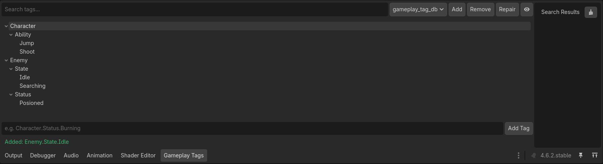
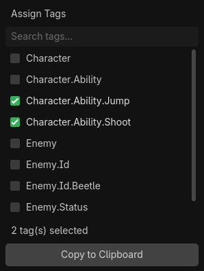
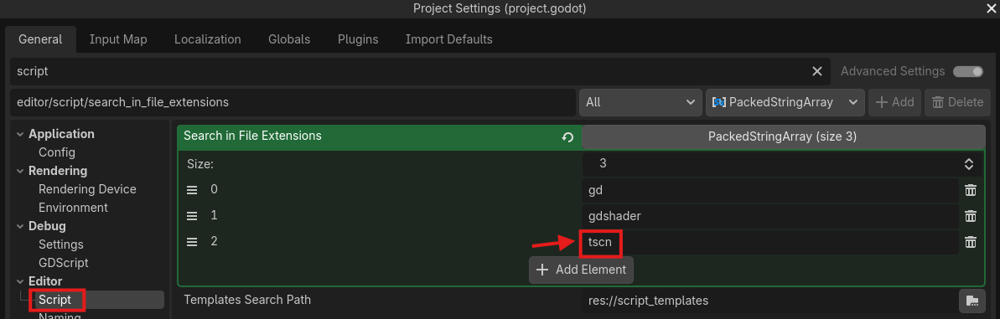

# Godot String Tags

A lightweight hierarchical tag system for Godot 4, inspired by Unreal Engine's Gameplay Tag system. Tags are dot-notation strings that express parent-child relationships, such as `Character.Status.Burning`. The addon provides an editor panel for managing your tag database, an inspector widget for assigning tags to nodes, and a runtime API for querying them.

[See why I chose strings vs objects](#why-strings)

## Installation

1. Copy the `addons/godot_string_tags` folder into your project's `addons` folder.
2. Open **Project > Project Settings > Plugins** and enable **Godot String Tags**.

## Concepts

**Tags** are dot-notation strings. Each segment implies a parent. Adding `Character.Status.Burning` automatically creates `Character` and `Character.Status` if they do not already exist.

**The Registry** is an autoload singleton called `GameplayTagRegistry` that loads on startup and manages your tag database. You do not need to reference it directly in most cases.

**A Tag Container** (`GameplayTagContainer`) is a resource you attach to any node via an exported property. It holds the tags that are currently active on that object.

**Databases** are `.tres` files that store your registered tags. You can have multiple databases per project and switch between them in the editor panel.

## Setting Up Tags

Open the **Gameplay Tags** panel in the bottom dock of the Godot editor. Type a tag in dot-notation and press **Add Tag** or hit Enter. The hierarchy automatic and it's organized into a tree.



Right-clicking any tag in the tree gives you options to copy, rename, or delete it.

Single-clicking a tag copies its full path to the clipboard so you can paste it directly into your scripts.

## Assigning Tags to Nodes

Declare an exported property on any node:

```gdscript
@export var tags: GameplayTagContainer
```

Select the node in the editor and click **Edit Tags** in the Inspector to open the tag picker. Check the tags you want to assign to this node.

## Querying Tags at Runtime

```gdscript
# Hierarchical match — true if the container has this tag or any descendant
if entity.tags.has_tag("Character.Status"):
    apply_status_effects()

# Exact match only
if entity.tags.has_exact("Character.Status.Burning"):
    apply_burn_damage()

# Check multiple tags
var required := GameplayTagContainer.new()
required.tags = ["Character.Status.Burning"]

if entity.tags.has_all(required):
    print("has everything required")

if entity.tags.has_any(required):
    print("has at least one")

if entity.tags.has_none(required):
    print("has none of these")
```

## Adding and Removing Tags at Runtime

```gdscript
entity.tags.add_tag("Character.Status.Burning")
entity.tags.remove_tag("Character.Status.Burning")

# React to changes
entity.tags.tags_changed.connect(_on_tags_changed)
```

## Tag Picker Shortcut

Press **Ctrl+Shift+T** anywhere in the editor to open the tag picker in clipboard mode. Select multiple tags and click **Copy to Clipboard**. The result is formatted as a comma-separated list of quoted strings ready to paste into your code. The shortcut can be rebound in **Editor Settings > Shortcuts**.



## Multiple Databases

Use the toolbar in the Gameplay Tags panel to create, switch between, and manage multiple tag databases. If a database file has been deleted or moved, use the **Repair** button to rescan the resources folder and restore it to the list.

## Finding Tags in Your Project

If you ever need to find tags (maybe after renaming them in your database), we can find them in scripts with the classic **Ctrl+Shift+F** Search in Files shortcut (since they are just strings). Godot's Search in Files does not search `.tscn` or `.tres` files by default, so if you have placed any tags in a GameplayTagContainer using the inspector we need to be able to find these as well. Luckyly we can search our scene files as well as our scripts. To enable this, go to **Project Settings > General > Editor > Script** and add `tscn` to the search file extensions. This allows you to find and replace tag strings across your entire project including scene files. Then, when we use Search in Files, be sure the .tscn filter is enabled.



## Why Strings

Most Gameplay Tag implementations use custom classes or objects to represent each tag, which is great! I chose a different route, to make Godot String Tags use plain strings. The goal is to keep the system as lightweight as possible. Strings require minimal memory overhead and no class instantiation, making the system fast to initialize and easy to serialize. (Also, strings just seem like such a Godot way of doing things :P)

**Pros of a string-based system**

- Low memory footprint. Strings < Objects (as far as memory goes)
- Serializable. Tags are plain text in your scene and resource files
- No dependency chain. Containers and queries work without any class instances in scope
- Find and replace friendly. Renaming tags across a project is a standard text search operation (which is already pretty good in Godot)

**Cons of a string-based system**

- No compile-time safety. Typos in tag strings are silent failures at runtime
- Renaming requires a manual find and replace across scripts and scene files.
- String comparison is slower than pointer comparison, though in practice this is negligible for typical tag counts
- No autocomplete for tag values in the script editor unless you copy them from the panel

If you are looking for an object based tag system, here are some that I've found (I can't vouch for them as I use my own string system so **USE AT YOUR OWN RISK**):

- [GDTag](https://github.com/DillaDJ/GDTag)
- [Godot Gameplay Tags](https://github.com/OctoD/godot-gameplay-tags)

Full GAS-like system:

- [Forge Godot](https://github.com/gamesmiths-guild/forge-godot) *C# Only
- [Godot Gameplay Systems](https://github.com/OctoD/godot-gameplay-systems) *Rewrite in Progress

## Thank You

I am by no means an expert dev. There might much better ways to approach tags, but this system worked great for me in my projects and I hope it can help you to.

**Disclaimer**
I wrote some if this addon with Claude. I do my best to use AI sparingly and personally I like the challenge of solving problems with code, but sometimes I hit a roadblock and my skills don't cut it. I understand if this dissapoints you, but know I plan to use AI less and less as my skills grow OR we find a better way to make AI more sustainable and use ethical/transparent training practices :P